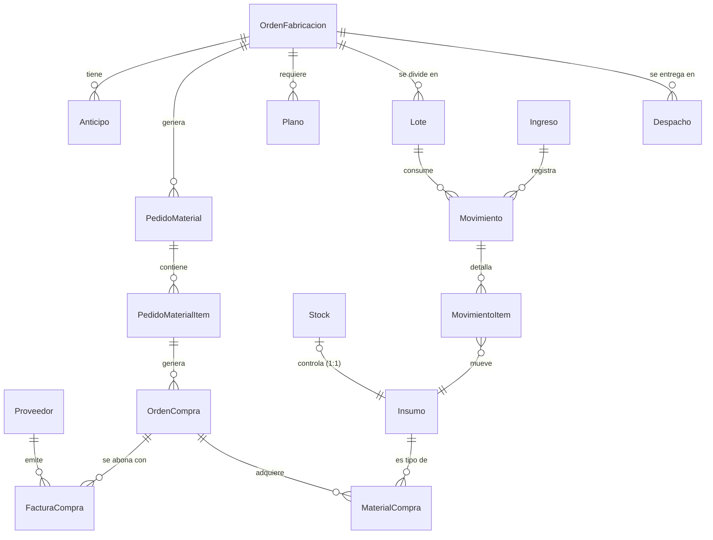

# ERP-LG — Manual de Referencia Técnica
## Capítulo 3: Modelo de Datos y Normalización

---

## 3.1 Diagrama Entidad-Relación (ER)

El modelo de datos de ERP-LG está diseñado para soportar la trazabilidad completa de una Orden de Fabricación (OF) a lo largo de los siete dominios del sistema. El diseño actual es el resultado de un riguroso proceso de refactorización y normalización (aplicado en la migración `0002`) para eliminar redundancias y garantizar la integridad referencial.

A continuación, se presenta el esquema general de entidades y sus relaciones:

---

## 3.2 Catálogo de Modelos por Dominio

| Dominio | Modelo | Función Principal | Relaciones Clave |
|---------|--------|-------------------|------------------|
| **Comercial** | `OrdenFabricacion` | Raíz del sistema. Representa el pedido del cliente. | FK de múltiples dominios. |
| | `Anticipo` | Registro de pagos adelantados para una OF. | `orden_fabricacion` (FK) |
| **Compras** | `Proveedor` | Catálogo de proveedores. | |
| | `Insumo` | Catálogo maestro de materiales. | |
| | `FacturaCompra` | Registro de comprobantes de pago. | `proveedor` (FK), `orden_compra` (FK) |
| | `MaterialCompra` | Detalle de insumos adquiridos. | `insumo` (FK), `orden_compra` (FK) |
| **Desarrollo** | `PedidoMaterial` | Solicitud interna de materiales para una OF. | `of` (FK) |
| | `PedidoMaterialItem` | Líneas de detalle de un pedido de material. | `pedido_material` (FK) |
| | `OrdenCompra` | Documento formal enviado al proveedor. | `pedido_material_item` (FK) |
| | `Plano` | Documentos técnicos asociados a la OF. | `of` (FK) |
| **Pañol** | `Ingreso` | Remitos o documentos de entrada de material. | |
| | `Stock` | Inventario actual valorizado y en unidades. | `insumo` (O2O) |
| | `Movimiento` | Transacción de entrada/salida de pañol. | `ingreso` (FK), `lote` (FK) |
| | `MovimientoItem` | Detalle de insumos movidos. | `movimiento` (FK), `insumo` (FK) |
| **Producción**| `Lote` | Unidad de fabricación en el taller. Estado: `pre_produccion`→`produccion`→`final_produccion`→`terminado`→`en_despacho`. `observaciones` JSONField registra cada transición. | `of_id` (FK), `planos` (M2M), `movimientos` (M2M) |
| **Logística** | `Despacho` | Registro de entrega de Lotes/OF al cliente. | `of` (FK) |

---

## 3.3 Análisis de Formas Normales (Refactoring)

El modelo de datos inicial (migración `0001_initial`) presentaba múltiples desnormalizaciones por diseño rápido. Durante la migración `0002`, el esquema se llevó a la **Tercera Forma Normal (3NF)**:

1. **Primera Forma Normal (1NF):** Se eliminaron grupos repetitivos. Se resolvió el antipatrón de campos como `JSONField` para almacenar listas de IDs (ej. planos asociados a un lote) reemplazándolos por relaciones estructurales (`ManyToManyField` o delegación en FKs).
2. **Segunda Forma Normal (2NF):** Todos los atributos no clave ahora dependen de la clave primaria completa.
3. **Tercera Forma Normal (3NF):** Se eliminaron dependencias transitivas. Ningún atributo no clave depende de otro atributo no clave.

### Las 12 Redundancias Eliminadas

Durante la normalización se identificaron y eliminaron campos redundantes que almacenaban nombres o datos duplicados (ej. `cliente_nombre` en tablas hijas cuando ya existía en la OF, o `nombre_insumo` cuando ya había una relación con `Insumo`). 

**Problema original:** Mantener campos redundantes causaba anomalías de actualización. Si un nombre cambiaba, había que actualizar múltiples tablas.
**Solución:** Se reemplazaron por relaciones ForeignKey. Si bien esto implica realizar `JOINs` (a través de `select_related` o `prefetch_related` en el backend) al consultar la base de datos, asegura consistencia y fuente única de verdad.

---

## 3.4 Decisiones de Diseño y Deuda Técnica Documentada

### 1. `null=True` en ForeignKeys de Reemplazo
Al aplicar la migración `0002` en datos existentes, las nuevas Foreign Keys se definieron con `null=True` (ej. `FacturaCompra.proveedor_id`). 
* **Justificación:** Era necesario para permitir que la migración se aplicara sin romper los registros históricos que no tenían la relación establecida de forma estricta.
* **Deuda Técnica:** A futuro, se requiere un script de migración de datos (RunPython) para poblar estos FKs en registros huérfanos y posteriormente alterar la columna a `null=False` garantizando la integridad referencial estricta.

### 2. `@property` como Capa de Compatibilidad
Para no romper contratos existentes con el frontend y otras partes del código tras la normalización, se implementaron propiedades calculadas en los modelos.
* **Ejemplos:**
  * `Stock.nombre`: Devuelve `self.insumo.nombre`.
  * `MaterialCompra.nombre`: Devuelve `self.insumo.nombre`.
  * `FacturaCompra.proveedor_nombre`: Devuelve `self.proveedor.nombre` o un fallback de compatibilidad.
* **Impacto:** Mantiene la interfaz de serialización (DRF) estable mientras el esquema subyacente se moderniza.

### 3. `JSONField` vs `ManyToManyField`
El uso de `JSONField` para relacionar entidades (ej. `Lote.planos_asociados` conteniendo `[1, 2, 3]`) es un antipatrón relacional porque impide usar restricciones de integridad referencial (FK constraints) y dificulta consultas inversas. 
* **Caso Lote:** Se identificó como un antipatrón. Las relaciones N:M verdaderas deben gestionarse con `models.ManyToManyField` para que la base de datos (MariaDB) maneje la integridad a nivel de motor.

### 4. `OneToOneField` vs `ForeignKey`
Se aplicó una decisión estricta de cardinalidad en el modelo `Stock`.
* **Caso:** `Stock` y `Insumo`. Se utilizó `models.OneToOneField` en `Stock` apuntando a `Insumo` porque, por regla de negocio, solo puede haber un único registro de consolidado de inventario por cada Insumo físico. Usar `ForeignKey` permitiría (erróneamente) múltiples registros de stock para un mismo tornillo, causando inconsistencias de inventario.

---

## 3.5 Historial de Migraciones Clave

* **`0001_initial.py`**: Representa la estructura monolítica fundacional, creada rápidamente para validación de producto. Contenía strings redundantes y JSONFields para evitar migraciones complejas tempranas.
* **`0002_*` (Normalización)**: Un conjunto de migraciones aplicadas en todos los dominios (`comercial/0002`, `compras/0002`, `panol/0002`, etc.) que eliminaron campos `_nombre`, agregaron Foreign Keys relacionales hacia los catálogos maestros (`Insumo`, `Proveedor`), y transformaron el modelo a 3NF.
* **`produccion/0003_lote_observaciones`**: Agrega el campo `observaciones = JSONField(default=list)` al modelo `Lote` para registrar el historial de transiciones de estado con texto de auditoría. La migración `0002` de producción fue fakeada (`--fake`) por desincronía entre la DB y el estado de migraciones; `0003` registra solo el `AddField` real.
